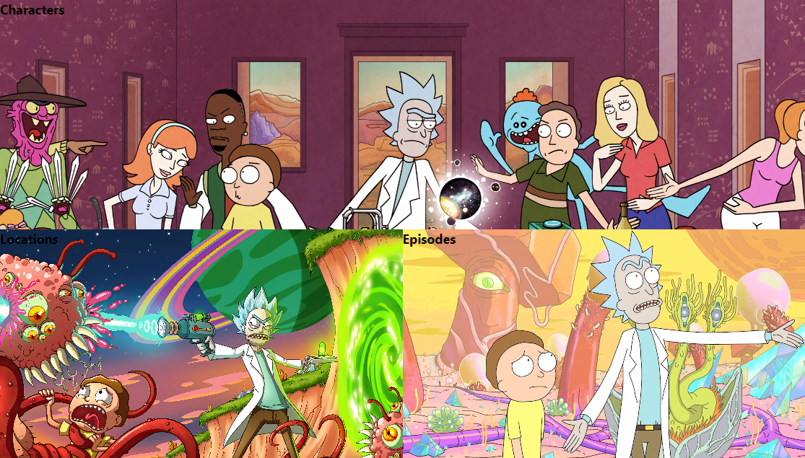

# Rick and Morty App - ReactJS

## 📝 Project Description

This project is a React.js web app that displays details of characters from the Rick and Morty show, details about the episodes and locations of the tv series. It fetches data from the Rick and Morty API and displays it in a user-friendly way.

## :link: Live Demo

[Demo Link](https://rick-and-mortyapi.vercel.app/)

## 📷 Screenshot

<div>

#### Old Home Page

  

#### New Home Page

  
</div>

<div>

#### Old Characters Page

  

#### New Characters Page

  
</div>

<div>

#### Old Episodes/Location Page

  

#### New Episodes/Location Page

  
</div>

</div>

## 📚 Technologies

- ReactJS
- Axios
- TailwindCSS

## :compass: Roadmap

- [x] Fetch characters
- [x] Add search bar
- [x] Add filters
  - [x] Status
  - [x] Gender
  - [x] Species
- [x] Fetch episodes + characters
- [x] Fetch location + characters

## :runner: Run Locally

Clone the project

```bash
  git clone https://github.com/trstefan/rick-and-mortyapi
```

Go to the project directory

```bash
  cd rick-and-mortyapi
```

Install dependencies

```bash
  npm install
```

Start the server

```bash
  npm run start
```

## :star: Acknowledgements

- [The Rick and Morty API](https://rickandmortyapi.com/)
- [Axios](https://www.npmjs.com/package/axios)
